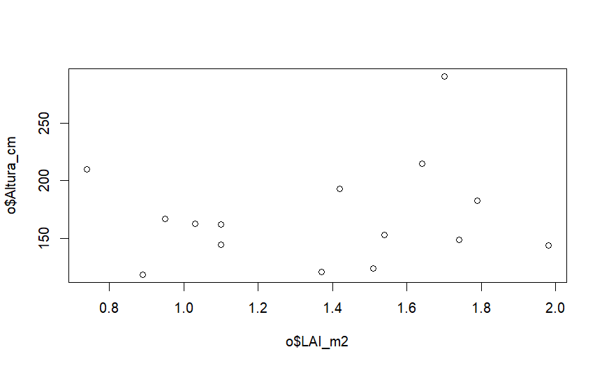
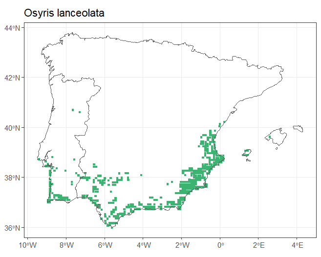

\pagebreak

# R Markdown Osyris lanceolata

## Proyecto de dinámicas poblacionales

### Ecoinformática - ejercicio práctico

## Introducción

El siguiente proyecto pretende estudiar la **dinámica poblacional** de [*Osyris lanceolata*](https://www.gbif.org/es/species/7473922), comúnmente conocida como bayón.

*Osyris lanceolata* se trata de una especie de planta hemiparásita, capaz de parasitar a otras especies a nivel del xilema, obteniendo de los hospedadores nutrientes, sales minerales y agua por medio de un órgano especializado llamado [**haustorio**](https://idus.us.es/handle/11441/53565).

{withd="60%"}

La formación del haustorio es potenciada por moléculas de señal generadas por el huésped, denominadas factores de inducción del haustorio (HIF), algunas de ellas son los compuestos fenólicos y quinonas [@luna2002parasitismo]. Dicha conexión le permite además, accionar un mecanismo secundario de defensa, ya que por medio de la relación íntima establecida, en caso de ataque a uno de sus hospedadores, las **ROS** (especies reactivas del oxígeno) serán capaces de llegar hasta el ejemplar de *Osyris lanceolata*, permitiéndole preparase frente al ataque previamente.

Para su determinación como facultativa, la planta parásita es capaz de florecer y fructificar solamente durante su estado preparasítico. Por otro lado, las plantas hemiparásitas obligadas, son predadoras fotosintéticas del xilema pero, siendo parásitas caulinares, no pueden existir independientemente de su hospedante [@valera2012papel].

En este proyecto pretende observar la posible relación entre el **LAI** (Índice de área foliar) y la **altura** de cada uno de los individuos. Para estudiar la correspondencia entre dichas variables, partimos de una base de datos con 15 individuos en las que no hay distinción previa entre machos y hembras, ya que la especie presenta ambos sexos en el mismo individuo.

```{{r}}
read.csv(file="basededatos1"), header = TRUE, sep = ",")
knitr::kable(
basededatos1[1:15, ]
)
```

## Zona de estudio

*Osyris lanceolata* presenta una distribución muy amplia en la Península Ibérica, siendo los principales focos de arraigamiento zonas del litoral atlántico y el Mar mediterráneo. Este estudio se desarrollará en **el Acantilado del Asperillo, Huelva**.

```{r interactive map}
library(leaflet)
datos<-data.frame(
  lat=c(37.093844207328495),
  lon= c(-6.7333759886534095),
  ciudad= c("Acantilado del Asperillo")
)

m<-leaflet(data=datos)%>%
  addTiles()%>%
  addMarkers(~lon, ~lat, popup = ~ciudad)
m
```

## Relación del LAI con la altura

```{r, message=FALSE, warning=FALSE, echo=FALSE}
library(tidyverse)
library(ggplot2)
o<-read.csv(file = "basededatos1.txt", header = TRUE, sep = ",")
plot(o)
```



En la siguiente gráfica se puede observar como las variables **altura** y **LAI** no presentan correlación. El valor del índice de área foliar no depende de la altura del individuo.

## Distribución poblacional
La distribución poblacional se ha obtenido con el siguiente código:
install.packages("devtools")
devtools::install_github("Pakillo/FloraIberica")
library(FloraIberica)
map_distribution(genus = "Osyris", species = "lanceolata", size = 0.9)

